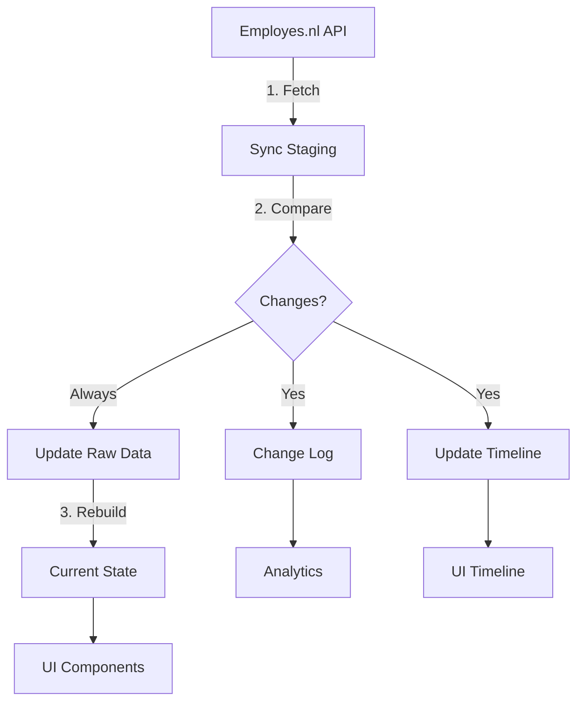

# 🏗️ TEMPORAL DATA ARCHITECTURE 2.0 - ULTRA DEEP DIVE

**Date**: October 6, 2025  
**Status**: Strategic Planning Phase  
**Goal**: Design scalable, efficient temporal data system for 1000+ syncs

---

## 🎯 **CORE REQUIREMENTS ANALYSIS**

### **What Changes & How Often**

#### **High Frequency Changes** (Monthly/Weekly)
- 📍 **Location/Department** - Employee moves teams
- 👔 **Manager** - Reporting structure changes
- 📧 **Contact Info** - Email, phone, address
- 🏢 **Office Assignment** - Desk, building, remote status
- ⏰ **Working Hours** - Schedule adjustments

#### **Medium Frequency Changes** (Quarterly/Yearly)
- 💰 **Salary** - Annual reviews, promotions
- 📄 **Contract Type** - Temp to permanent
- 🎯 **Role/Title** - Job progression
- 📊 **Employment Status** - Active, leave, etc.

#### **Low Frequency Changes** (Rare)
- 🎂 **Personal Data** - Name (marriage), nationality
- 🏦 **Banking** - IBAN changes
- 🆔 **Legal IDs** - BSN, passport

#### **Never Changes**
- 🔑 **Employee ID** - Permanent identifier
- 📅 **Start Date** - Historical fact
- 🎂 **Birth Date** - (unless data correction)

---

## 📊 **SYNC VOLUME PROJECTIONS**

### **Scenario Analysis**

#### **Monthly Full Sync** (Conservative)
```
Year 1: 12 syncs × 100 employees = 1,200 records/year
Year 5: 60 syncs × 150 employees = 9,000 total records
```

#### **Weekly Department Sync** (Realistic)
```
Year 1: 52 syncs × 100 employees = 5,200 records/year
Year 5: 260 syncs × 150 employees = 39,000 total records
```

#### **Daily Active Sync** (Aggressive)
```
Year 1: 365 syncs × 100 employees = 36,500 records/year
Year 5: 1,825 syncs × 150 employees = 273,750 total records
```

**Storage Impact**: 
- Raw JSON per employee: ~5-10 KB
- 273,750 records × 10 KB = **2.7 GB** (manageable!)

---

## 🏛️ **PROPOSED 5-TABLE ARCHITECTURE**

### **Table 0: `employes_current_state`** 🚀 **FAST READ TABLE**
```sql
CREATE TABLE employes_current_state (
  -- Primary Key
  employee_id UUID PRIMARY KEY,
  
  -- Core Data (What UI Actually Needs)
  full_name TEXT NOT NULL,
  email TEXT,
  phone TEXT,
  department TEXT,
  location TEXT,
  manager_id UUID,
  role TEXT,
  
  -- Employment
  employment_status TEXT,
  contract_type TEXT,
  start_date DATE,
  end_date DATE,
  
  -- Compensation (Latest)
  current_salary DECIMAL(10,2),
  current_hours_per_week DECIMAL(5,2),
  salary_effective_date DATE,
  
  -- Personal
  birth_date DATE,
  nationality TEXT,
  address JSONB,
  
  -- Metadata
  last_updated_at TIMESTAMPTZ DEFAULT NOW(),
  last_sync_id UUID,
  data_quality_score DECIMAL(3,2), -- 0.00 to 1.00
  
  -- Indexes
  INDEX idx_current_state_department (department),
  INDEX idx_current_state_location (location),
  INDEX idx_current_state_manager (manager_id)
);
```

**Purpose**: 
- ⚡ **ULTRA FAST** reads for UI
- 📊 Single row per employee
- 🔄 Updated after each sync
- 🎯 Only fields we actually use

---

### **Table 1: `employes_raw_data`** 📦 **SOURCE OF TRUTH**
```sql
-- EXISTING TABLE - NO CHANGES
CREATE TABLE employes_raw_data (
  id UUID PRIMARY KEY,
  employee_id UUID NOT NULL,
  endpoint TEXT NOT NULL,
  api_response JSONB NOT NULL,
  collected_at TIMESTAMPTZ DEFAULT NOW(),
  is_latest BOOLEAN DEFAULT false,
  payload_hash TEXT GENERATED ALWAYS AS (md5(api_response::text)) STORED,
  
  -- Only ONE latest per employee/endpoint
  UNIQUE (employee_id, endpoint) WHERE is_latest = true
);
```

**Purpose**:
- 🔐 Complete, unmodified API responses
- 📜 Legal/audit trail
- 🔄 One latest record per endpoint
- 💾 Source for all derived tables

---

### **Table 2: `employes_sync_staging`** 🔄 **TEMPORARY STAGING**
```sql
CREATE TABLE employes_sync_staging (
  id UUID PRIMARY KEY,
  sync_session_id UUID NOT NULL,
  employee_id UUID NOT NULL,
  endpoint TEXT NOT NULL,
  api_response JSONB NOT NULL,
  collected_at TIMESTAMPTZ DEFAULT NOW(),
  processing_status TEXT DEFAULT 'pending', -- pending, processed, failed
  processing_notes TEXT,
  
  -- Auto-cleanup after 7 days
  expires_at TIMESTAMPTZ DEFAULT NOW() + INTERVAL '7 days',
  
  INDEX idx_staging_session (sync_session_id),
  INDEX idx_staging_status (processing_status),
  INDEX idx_staging_expires (expires_at)
);
```

**Purpose**:
- 🚦 Incoming data buffer
- 🔍 Pre-processing validation
- 🗑️ Auto-cleanup old data
- 🔄 Comparison source

---

### **Table 3: `employes_change_log`** 📝 **CHANGE HISTORY**
```sql
CREATE TABLE employes_change_log (
  id UUID PRIMARY KEY DEFAULT gen_random_uuid(),
  
  -- What changed
  employee_id UUID NOT NULL,
  field_path TEXT NOT NULL, -- 'salary', 'department', 'address.city'
  
  -- When it changed
  change_detected_at TIMESTAMPTZ DEFAULT NOW(),
  effective_date DATE, -- When change actually happened
  sync_session_id UUID NOT NULL,
  
  -- The change
  old_value JSONB,
  new_value JSONB,
  change_type TEXT, -- 'update', 'correction', 'initial'
  
  -- Analytics metadata
  change_category TEXT, -- 'compensation', 'organizational', 'personal'
  business_impact TEXT, -- 'salary_increase', 'promotion', 'relocation'
  confidence_score DECIMAL(3,2), -- How sure are we?
  
  -- Tracking
  is_verified BOOLEAN DEFAULT false,
  verified_by UUID,
  verified_at TIMESTAMPTZ,
  
  -- Indexes for analytics
  INDEX idx_change_employee_date (employee_id, effective_date DESC),
  INDEX idx_change_category (change_category, change_detected_at DESC),
  INDEX idx_change_session (sync_session_id),
  INDEX idx_change_impact (business_impact) WHERE business_impact IS NOT NULL
);
```

**Purpose**:
- 📈 Analytics goldmine
- 🔍 Audit trail
- 📊 Trend analysis
- 🎯 Change patterns

---

### **Table 4: `employes_timeline`** 📅 **EMPLOYMENT TIMELINE**
```sql
CREATE TABLE employes_timeline (
  id UUID PRIMARY KEY DEFAULT gen_random_uuid(),
  employee_id UUID NOT NULL,
  
  -- Timeline entry
  event_type TEXT NOT NULL, -- 'hired', 'promoted', 'salary_change', 'contract_renewal'
  event_date DATE NOT NULL,
  event_description TEXT,
  
  -- Event details
  event_data JSONB, -- Flexible storage for event-specific data
  
  -- Contract/salary at this point
  salary_at_event DECIMAL(10,2),
  hours_at_event DECIMAL(5,2),
  role_at_event TEXT,
  department_at_event TEXT,
  
  -- Source
  source_sync_id UUID,
  source_table TEXT, -- 'employes_raw_data', 'manual_entry', 'import'
  
  -- Validity
  valid_from DATE NOT NULL,
  valid_to DATE, -- NULL = current
  is_current BOOLEAN DEFAULT false,
  
  -- Unique: One current timeline entry per employee
  UNIQUE (employee_id, event_type, event_date),
  
  -- Indexes
  INDEX idx_timeline_employee_date (employee_id, event_date DESC),
  INDEX idx_timeline_current (employee_id) WHERE is_current = true,
  INDEX idx_timeline_event_type (event_type, event_date DESC)
);
```

**Purpose**:
- 📊 Visual timeline for UI
- 🎯 Contract progression
- 💰 Salary history
- 📈 Career path tracking

---

## 🔄 **DATA FLOW ARCHITECTURE**

### **Sync Process Flow**



### **Detailed Steps**

#### **Step 1: Data Collection**
```typescript
async function collectData(employeeId: string, sessionId: string) {
  // Fetch from API
  const apiData = await fetchFromEmployes(employeeId);
  
  // Store in staging
  await supabase.from('employes_sync_staging').insert({
    sync_session_id: sessionId,
    employee_id: employeeId,
    endpoint: '/employees',
    api_response: apiData,
    processing_status: 'pending'
  });
}
```

#### **Step 2: Change Detection**
```typescript
async function detectChanges(employeeId: string, sessionId: string) {
  // Get staging data
  const staging = await getFromStaging(employeeId, sessionId);
  
  // Get current state
  const current = await supabase
    .from('employes_current_state')
    .select('*')
    .eq('employee_id', employeeId)
    .single();
  
  // Deep comparison
  const changes = deepCompare(current, staging);
  
  // Log each change
  for (const change of changes) {
    await supabase.from('employes_change_log').insert({
      employee_id: employeeId,
      field_path: change.field,
      old_value: change.oldValue,
      new_value: change.newValue,
      sync_session_id: sessionId,
      change_category: categorizeChange(change.field),
      business_impact: assessImpact(change)
    });
  }
}
```

#### **Step 3: Update Current State**
```typescript
async function updateCurrentState(employeeId: string) {
  // Get latest raw data
  const rawData = await supabase
    .from('employes_raw_data')
    .select('*')
    .eq('employee_id', employeeId)
    .eq('is_latest', true);
  
  // Transform to current state
  const currentState = transformToCurrentState(rawData);
  
  // Upsert
  await supabase
    .from('employes_current_state')
    .upsert(currentState, {
      onConflict: 'employee_id'
    });
}
```

---

## 📊 **ANALYTICS CAPABILITIES**

### **With This Architecture, We Can Answer:**

#### **Individual Analytics**
- "Show me all changes for Employee X"
- "When did Employee X get their last raise?"
- "How many times has Employee X changed departments?"

#### **Organizational Analytics**
- "Average time between salary increases by department"
- "Department transfer patterns"
- "Promotion velocity by role"

#### **Trend Analytics**
- "Salary growth trends over 5 years"
- "Turnover patterns by season"
- "Contract type evolution"

#### **Quality Analytics**
- "Data completeness scores"
- "Sync reliability metrics"
- "Change detection accuracy"

---

## 🚀 **PERFORMANCE OPTIMIZATIONS**

### **1. Materialized Views for Common Queries**
```sql
CREATE MATERIALIZED VIEW mv_employee_latest_changes AS
SELECT 
  e.employee_id,
  e.full_name,
  e.department,
  cl.field_path,
  cl.new_value,
  cl.change_detected_at
FROM employes_current_state e
LEFT JOIN LATERAL (
  SELECT * FROM employes_change_log
  WHERE employee_id = e.employee_id
  ORDER BY change_detected_at DESC
  LIMIT 5
) cl ON true;

-- Refresh daily
CREATE INDEX ON mv_employee_latest_changes(employee_id);
```

### **2. Partitioning for Scale**
```sql
-- Partition change_log by year
ALTER TABLE employes_change_log 
PARTITION BY RANGE (EXTRACT(YEAR FROM change_detected_at));

CREATE TABLE employes_change_log_2025 
PARTITION OF employes_change_log
FOR VALUES FROM (2025) TO (2026);
```

### **3. Archival Strategy**
```sql
-- Archive old staging data
CREATE TABLE employes_sync_staging_archive (
  LIKE employes_sync_staging INCLUDING ALL
) PARTITION BY RANGE (collected_at);

-- Move old data
INSERT INTO employes_sync_staging_archive
SELECT * FROM employes_sync_staging
WHERE expires_at < NOW();
```

---

## 💾 **STORAGE PROJECTIONS**

### **After 1000 Syncs (100 Employees)**

| Table | Records | Avg Size | Total |
|-------|---------|----------|-------|
| current_state | 100 | 2 KB | 200 KB |
| raw_data | 200 | 10 KB | 2 MB |
| sync_staging | 100 | 10 KB | 1 MB |
| change_log | 10,000 | 1 KB | 10 MB |
| timeline | 500 | 2 KB | 1 MB |
| **TOTAL** | | | **~15 MB** |

### **After 5 Years (150 Employees, Weekly Syncs)**

| Table | Records | Avg Size | Total |
|-------|---------|----------|-------|
| current_state | 150 | 2 KB | 300 KB |
| raw_data | 300 | 10 KB | 3 MB |
| sync_staging | 150 | 10 KB | 1.5 MB |
| change_log | 50,000 | 1 KB | 50 MB |
| timeline | 2,000 | 2 KB | 4 MB |
| **TOTAL** | | | **~60 MB** |

**Conclusion**: Storage is NOT a concern! 🎉

---

## 🔧 **IMPLEMENTATION ROADMAP**

### **Phase 1: Foundation** (NOW)
1. ✅ Keep `employes_raw_data` as is
2. ✅ Fix duplicate changes issue
3. ✅ Continue using current system

### **Phase 2: Current State Table** (Week 1)
1. Create `employes_current_state` table
2. Build transformer from raw_data → current_state
3. Update UI to read from current_state
4. Measure performance improvement

### **Phase 3: Change Log Enhancement** (Week 2)
1. Migrate `employes_changes` → `employes_change_log`
2. Add field_path tracking
3. Add business_impact categorization
4. Build analytics dashboard

### **Phase 4: Timeline System** (Week 3)
1. Create `employes_timeline` table
2. Build timeline generator
3. Create timeline UI component
4. Add timeline to staff profile

### **Phase 5: Staging & Optimization** (Week 4)
1. Implement staging table
2. Add auto-cleanup jobs
3. Create materialized views
4. Performance testing

---

## 🎯 **IMMEDIATE ACTION (RIGHT NOW)**

### **Quick Fix for Duplicates**
```sql
-- Add detection tracking to existing table
ALTER TABLE employes_changes 
ADD COLUMN IF NOT EXISTS sync_session_id UUID,
ADD COLUMN IF NOT EXISTS is_duplicate BOOLEAN DEFAULT false;

-- Mark duplicates (don't delete yet)
UPDATE employes_changes SET is_duplicate = true
WHERE id IN (
  SELECT id FROM (
    SELECT id, ROW_NUMBER() OVER (
      PARTITION BY employee_id, effective_date, change_type, field_name 
      ORDER BY created_at ASC
    ) as rn
    FROM employes_changes
  ) t WHERE rn > 1
);

-- UI can filter: WHERE is_duplicate = false
```

### **Update Change Detector**
```typescript
// Add session tracking
async function insertChange(supabase: any, change: any, sessionId: string) {
  // Check if this exact change exists
  const { data: existing } = await supabase
    .from('employes_changes')
    .select('id')
    .eq('employee_id', change.employee_id)
    .eq('effective_date', change.effective_date)
    .eq('change_type', change.change_type)
    .eq('field_name', change.field_name)
    .eq('old_value', change.old_value)
    .eq('new_value', change.new_value)
    .single();
  
  if (!existing) {
    // New change detected!
    await supabase.from('employes_changes').insert({
      ...change,
      sync_session_id: sessionId,
      is_duplicate: false
    });
  } else {
    // Change already known, just update last seen
    await supabase
      .from('employes_changes')
      .update({ 
        last_verified_at: new Date().toISOString(),
        sync_session_id: sessionId 
      })
      .eq('id', existing.id);
  }
}
```

---

## 🤔 **QUESTIONS FOR YOU**

1. **Sync Frequency**: How often do you realistically expect to sync?
   - Daily? Weekly? Monthly? On-demand?

2. **Historical Data**: How far back do you need to keep?
   - All time? Last 5 years? Configurable?

3. **Analytics Priority**: What's most important?
   - Individual employee insights?
   - Department-level trends?
   - Company-wide patterns?

4. **Performance**: Current speed is good?
   - Need faster? (current_state table will help)
   - OK with current? (keep as is)

5. **Timeline**: When to implement full architecture?
   - Now? After MVP? Gradually?

---

## 💡 **MY RECOMMENDATION**

### **Start Simple, Evolve Smart**

1. **NOW**: Fix duplicates with session tracking
2. **NEXT WEEK**: Add `employes_current_state` for speed
3. **MONTH 1**: Implement change_log with categories
4. **MONTH 2**: Build timeline system
5. **MONTH 3**: Add analytics dashboard

**Why This Order**:
- ✅ Immediate problem solved
- ✅ Performance boost quickly
- ✅ Analytics foundation built
- ✅ Timeline for better UX
- ✅ Full system without disruption

---

**What do you think? Which parts resonate? What should we adjust?** 🎯
