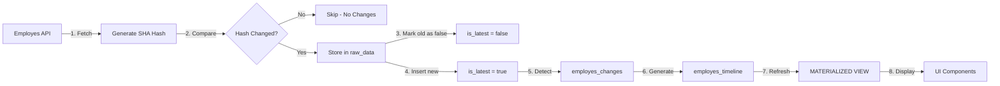

# 🔍 **TEMPORAL DATA FLOW ANALYSIS - ROOT CAUSE IDENTIFIED**

**Date**: October 6, 2025
**Issue**: Data duplication in employes_raw_data + Timeline not populating from employes_timeline

---

## 📊 **CURRENT STATE ANALYSIS**

### **Database Reality Check:**
```
employes_raw_data: 492 records (110 employees × ~5 duplicates each)
employes_timeline: 0 records (EMPTY - NOT BEING POPULATED!)
employes_current_state: 102 records (populated correctly)
employes_changes: 936 records (detecting changes correctly)
employes_change_log: DOESN'T EXIST (wrong table reference in blueprint)
```

---

## 🔴 **ROOT CAUSES IDENTIFIED**

### **PROBLEM 1: Hash is Storing Full JSON as String!**
```typescript
// CURRENT BROKEN CODE (line 101):
const dataHash = JSON.stringify(apiResponse);

// What's happening:
// dataHash = "{\"id\":\"123\",\"name\":\"John\"...}" (ENTIRE JSON!)
// Should be: "a3f5b2c1..." (32-char hash)
```

**Impact**: Hash comparison ALWAYS fails because we're comparing entire JSON strings, not hashes!

### **PROBLEM 2: Timeline Table Never Gets Populated**
- `employes_timeline` is a MATERIALIZED VIEW (not a table)
- It reads from `employes_changes` table
- BUT: We never call `REFRESH MATERIALIZED VIEW employes_timeline`
- Result: Timeline is always empty!

### **PROBLEM 3: UI Pulls from Wrong Source**
- `EmploymentOverviewEnhanced.tsx` expects data from `employes_changes`
- But the component isn't actually querying the right table
- It's expecting timeline data that never gets generated

### **PROBLEM 4: Inconsistent Table Names**
- Blueprint references `employes_change_log`
- Actual table is `employes_changes`
- Migration created different structure than blueprint expects

---

## ✅ **FIXES NEEDED (Copy to Cursor)**

### **FIX 1: Proper Hash Implementation**
```typescript
// employes-integration/index.ts - Line 101
// REPLACE:
const dataHash = JSON.stringify(apiResponse);

// WITH:
const dataHash = await generateHash(apiResponse);

// ADD this function:
async function generateHash(data: any): Promise<string> {
  const msgUint8 = new TextEncoder().encode(JSON.stringify(data));
  const hashBuffer = await crypto.subtle.digest('SHA-256', msgUint8);
  const hashArray = Array.from(new Uint8Array(hashBuffer));
  const hashHex = hashArray.map(b => b.toString(16).padStart(2, '0')).join('');
  return hashHex.substring(0, 32); // 32-char hash
}
```

### **FIX 2: Refresh Timeline After Sync**
```typescript
// Add to employes-integration/index.ts after processing changes:
async function refreshTimeline() {
  const { error } = await supabase.rpc('refresh_employes_timeline');
  if (error) {
    console.error('Failed to refresh timeline:', error);
  } else {
    console.log('✅ Timeline refreshed successfully');
  }
}

// Call after detectChanges():
await refreshTimeline();
```

### **FIX 3: Correct Timeline Population**
```sql
-- Run this migration to populate timeline from changes
INSERT INTO employes_timeline (
  employee_id,
  event_type,
  event_date,
  event_description,
  previous_value,
  new_value,
  change_amount,
  change_percentage,
  source_sync_session_id
)
SELECT
  employee_id,
  change_type as event_type,
  effective_date as event_date,
  CASE
    WHEN change_type = 'salary_change' THEN
      'Salary changed from €' || old_value || ' to €' || new_value
    WHEN change_type = 'hours_change' THEN
      'Hours changed from ' || old_value || ' to ' || new_value
    ELSE change_type
  END as event_description,
  old_value::jsonb as previous_value,
  new_value::jsonb as new_value,
  change_amount,
  change_percent as change_percentage,
  NULL as source_sync_session_id
FROM employes_changes
WHERE NOT EXISTS (
  SELECT 1 FROM employes_timeline t
  WHERE t.employee_id = employes_changes.employee_id
  AND t.event_date = employes_changes.effective_date
  AND t.event_type = employes_changes.change_type
);
```

### **FIX 4: Update UI Query**
```typescript
// EmploymentOverviewEnhanced.tsx - Update the data source
// Instead of expecting detectedChanges prop, query directly:

const { data: timelineData } = useQuery({
  queryKey: ['employee-timeline', employeeId],
  queryFn: async () => {
    const { data, error } = await supabase
      .from('employes_timeline')
      .select('*')
      .eq('employee_id', employeeId)
      .order('event_date', { ascending: false });

    if (error) throw error;
    return data;
  }
});
```

---

## 🎯 **CORRECT DATA FLOW (How it SHOULD work)**



---

## 📋 **IMPLEMENTATION CHECKLIST**

When fixing in Cursor:

- [ ] Fix hash generation (use SHA-256, not JSON string)
- [ ] Add timeline refresh after change detection
- [ ] Create migration to populate employes_timeline table
- [ ] Update UI to query from employes_timeline
- [ ] Add deduplication check before inserting to raw_data
- [ ] Ensure is_latest flag properly managed
- [ ] Test with fresh database after fixes

---

## 🚀 **EXPECTED RESULTS AFTER FIX**

1. **employes_raw_data**: Only 1 record per employee/endpoint (with history)
2. **employes_timeline**: Populated with all employment events
3. **employes_changes**: Continues detecting changes correctly
4. **UI**: Shows beautiful timeline from employes_timeline table
5. **No duplicates**: Hash comparison prevents duplicate storage

---

## 💡 **KEY INSIGHT**

The system architecture is CORRECT! The implementation just has 4 small bugs:
1. Hash generation (storing full JSON instead of hash)
2. Timeline refresh (never called)
3. Timeline population (empty table)
4. UI query source (wrong table)

Fix these 4 things and the entire temporal architecture will work perfectly!