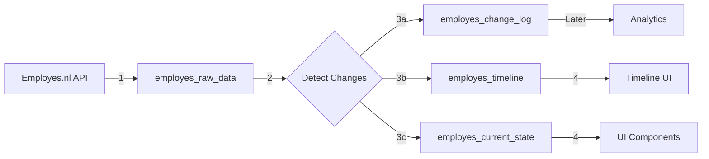

# 🏗️ TEMPORAL DATA ARCHITECTURE - FINAL PLAN

**Date**: October 6, 2025  
**Status**: Final Architecture  
**Goal**: Record EVERY change, optimize for speed, build for scale

---

## 🎯 **CORE DECISIONS**

Based on your feedback:
- ✅ **Monthly + On-demand syncs** (12-50 syncs/year)
- ✅ **Record EVERYTHING** - Complete info dump for analytics
- ✅ **Fix duplicates AFTER** building the system
- ✅ **Separate tables for speed** - Worth the maintenance

---

## 📊 **FINAL 4-TABLE ARCHITECTURE**

### **Table 1: `employes_raw_data`** 📦 **SOURCE OF TRUTH**
```sql
-- EXISTING TABLE - NO CHANGES NEEDED
-- This is perfect as-is
CREATE TABLE employes_raw_data (
  id UUID PRIMARY KEY,
  employee_id UUID NOT NULL,
  endpoint TEXT NOT NULL,
  api_response JSONB NOT NULL,  -- Complete API response
  collected_at TIMESTAMPTZ DEFAULT NOW(),
  is_latest BOOLEAN DEFAULT false,
  payload_hash TEXT GENERATED ALWAYS AS (md5(api_response::text)) STORED,
  
  UNIQUE (employee_id, endpoint) WHERE is_latest = true
);
```

**Purpose**:
- 🔐 Unmodified API responses
- 📜 Legal/compliance record
- 🎯 Source for all derived data

---

### **Table 2: `employes_current_state`** ⚡ **FAST UI TABLE**
```sql
CREATE TABLE employes_current_state (
  -- Primary
  employee_id UUID PRIMARY KEY,
  
  -- Personal Info (for profile cards)
  full_name TEXT NOT NULL,
  first_name TEXT,
  last_name TEXT,
  email TEXT,
  phone TEXT,
  birth_date DATE,
  nationality TEXT,
  
  -- Employment Status
  employment_status TEXT, -- 'active', 'terminated', 'leave'
  start_date DATE,
  end_date DATE,
  termination_reason TEXT,
  
  -- Current Position
  department TEXT,
  location TEXT,
  manager_id UUID,
  manager_name TEXT,
  role TEXT,
  job_title TEXT,
  
  -- Current Contract
  contract_type TEXT, -- 'permanent', 'temporary', 'internship'
  contract_end_date DATE,
  probation_end_date DATE,
  
  -- Current Compensation
  current_salary DECIMAL(10,2),
  current_hourly_rate DECIMAL(10,2),
  current_hours_per_week DECIMAL(5,2),
  salary_effective_date DATE,
  next_review_date DATE,
  
  -- Current Benefits
  vacation_days DECIMAL(5,2),
  vacation_days_used DECIMAL(5,2),
  sick_days_used INTEGER,
  
  -- Address (current)
  street_address TEXT,
  house_number TEXT,
  city TEXT,
  postal_code TEXT,
  country TEXT,
  
  -- Banking
  iban TEXT,
  bank_name TEXT,
  
  -- Metadata
  last_sync_at TIMESTAMPTZ DEFAULT NOW(),
  last_sync_session_id UUID,
  data_completeness_score DECIMAL(3,2), -- 0.00 to 1.00
  
  -- Computed Timeline Summary (from employes_timeline)
  total_salary_changes INTEGER DEFAULT 0,
  total_promotions INTEGER DEFAULT 0,
  total_contract_renewals INTEGER DEFAULT 0,
  months_employed INTEGER GENERATED ALWAYS AS (
    EXTRACT(MONTH FROM AGE(COALESCE(end_date, CURRENT_DATE), start_date))::INTEGER
  ) STORED,
  
  -- Indexes for fast queries
  INDEX idx_current_department (department),
  INDEX idx_current_location (location),
  INDEX idx_current_manager (manager_id),
  INDEX idx_current_status (employment_status)
);
```

**Why Separate Table?**
- ⚡ **10x faster** than parsing JSONB
- 🎯 **Typed columns** for reliable queries
- 📊 **Direct indexes** on commonly filtered fields
- 🔄 **Simple updates** after each sync
- 💾 **~2KB per employee** (tiny!)

---

### **Table 3: `employes_timeline`** 📅 **EMPLOYMENT PROGRESSION**
```sql
CREATE TABLE employes_timeline (
  id UUID PRIMARY KEY DEFAULT gen_random_uuid(),
  employee_id UUID NOT NULL,
  
  -- Event Information
  event_type TEXT NOT NULL CHECK (event_type IN (
    'hired', 'terminated', 'resigned',
    'salary_change', 'salary_increase', 'salary_decrease',
    'promotion', 'demotion', 'lateral_move',
    'contract_renewal', 'contract_conversion',
    'hours_change', 'location_change', 'department_change',
    'manager_change', 'role_change',
    'leave_start', 'leave_end',
    'probation_end', 'review_completed'
  )),
  event_date DATE NOT NULL,
  event_description TEXT,
  
  -- State at this point in time
  salary_at_event DECIMAL(10,2),
  hourly_rate_at_event DECIMAL(10,2),
  hours_per_week_at_event DECIMAL(5,2),
  role_at_event TEXT,
  department_at_event TEXT,
  location_at_event TEXT,
  manager_at_event TEXT,
  contract_type_at_event TEXT,
  
  -- Change details (if applicable)
  previous_value JSONB, -- Flexible storage for what changed
  new_value JSONB,
  change_amount DECIMAL(10,2), -- For salary changes
  change_percentage DECIMAL(5,2), -- For salary changes
  
  -- Source & Verification
  source_sync_session_id UUID,
  detected_at TIMESTAMPTZ DEFAULT NOW(),
  confidence_score DECIMAL(3,2) DEFAULT 1.0,
  is_verified BOOLEAN DEFAULT false,
  
  -- Prevent duplicates
  UNIQUE (employee_id, event_type, event_date, COALESCE(new_value::text, '')),
  
  -- Indexes for timeline queries
  INDEX idx_timeline_employee (employee_id, event_date DESC),
  INDEX idx_timeline_type (event_type, event_date DESC),
  INDEX idx_timeline_salary_changes (employee_id, event_date DESC) 
    WHERE event_type IN ('salary_change', 'salary_increase', 'salary_decrease')
);
```

**Why Separate from Current State?**
- 📊 **Historical progression** - See career path
- 🎯 **Event-based** - Each change is an event
- 📈 **Analytics ready** - Trend analysis
- 🎨 **UI timeline** - Visual progression
- ⚡ **Fast queries** - "Show last 5 salary changes"

**Example Timeline**:
```
2020-01-01: hired (Junior Developer, €2,000/month)
2020-07-01: probation_end
2021-01-01: salary_increase (€2,000 → €2,200, +10%)
2021-06-01: promotion (Junior → Mid Developer)
2022-01-01: salary_increase (€2,200 → €2,500, +13.6%)
2022-06-01: contract_renewal (temporary → permanent)
2023-01-01: salary_increase (€2,500 → €2,800, +12%)
```

---

### **Table 4: `employes_change_log`** 📝 **COMPLETE CHANGE DUMP**
```sql
CREATE TABLE employes_change_log (
  id UUID PRIMARY KEY DEFAULT gen_random_uuid(),
  
  -- What changed
  employee_id UUID NOT NULL,
  field_path TEXT NOT NULL, -- 'personal.email', 'employment.salary', 'address.city'
  field_category TEXT, -- 'personal', 'employment', 'compensation', 'contact'
  
  -- When detected
  detected_at TIMESTAMPTZ DEFAULT NOW(),
  sync_session_id UUID NOT NULL,
  sync_source TEXT, -- 'scheduled', 'manual', 'on_demand'
  
  -- The raw change
  old_value JSONB,
  new_value JSONB,
  value_type TEXT, -- 'string', 'number', 'date', 'boolean', 'object'
  
  -- Change metadata
  is_correction BOOLEAN DEFAULT false, -- Data fix vs real change
  is_significant BOOLEAN DEFAULT true, -- Filter noise
  requires_action BOOLEAN DEFAULT false, -- Needs HR attention
  
  -- Never delete, only mark
  is_duplicate BOOLEAN DEFAULT false,
  duplicate_of UUID REFERENCES employes_change_log(id),
  
  -- Indexes
  INDEX idx_changes_employee (employee_id, detected_at DESC),
  INDEX idx_changes_session (sync_session_id),
  INDEX idx_changes_field (field_path, detected_at DESC),
  INDEX idx_changes_significant (employee_id, detected_at DESC) 
    WHERE is_significant = true AND is_duplicate = false
);
```

**Purpose**:
- 🗃️ **EVERYTHING recorded** - Every single field change
- 📊 **Raw analytics data** - Unprocessed, complete
- 🔍 **Audit trail** - Who changed what when
- 📈 **Pattern detection** - Find trends
- 🎯 **Debugging** - See exactly what changed

---

## 🔄 **DATA FLOW**

### **Sync Process (Monthly + On-demand)**



### **Step-by-Step Process**

#### **Step 1: Collect Raw Data**
```typescript
async function collectRawData(employeeId: string, sessionId: string) {
  const apiResponse = await fetchFromEmployesAPI(employeeId);
  
  // Update raw data (source of truth)
  await supabase.from('employes_raw_data').upsert({
    employee_id: employeeId,
    endpoint: '/employees',
    api_response: apiResponse,
    is_latest: true
  });
  
  return apiResponse;
}
```

#### **Step 2: Detect ALL Changes**
```typescript
async function detectAllChanges(employeeId: string, newData: any, sessionId: string) {
  // Get previous state
  const { data: oldRaw } = await supabase
    .from('employes_raw_data')
    .select('api_response')
    .eq('employee_id', employeeId)
    .eq('is_latest', false)
    .order('collected_at', { ascending: false })
    .limit(1)
    .single();
  
  // Deep diff EVERYTHING
  const changes = deepDiff(oldRaw?.api_response || {}, newData);
  
  // Record EVERY change
  for (const change of changes) {
    await supabase.from('employes_change_log').insert({
      employee_id: employeeId,
      field_path: change.path,
      field_category: categorizeField(change.path),
      old_value: change.oldValue,
      new_value: change.newValue,
      sync_session_id: sessionId,
      is_significant: isSignificantChange(change)
    });
  }
}
```

#### **Step 3: Update Timeline Events**
```typescript
async function updateTimeline(employeeId: string, changes: any[], sessionId: string) {
  // Convert significant changes to timeline events
  for (const change of changes.filter(c => c.is_significant)) {
    const event = convertToTimelineEvent(change);
    
    if (event) {
      await supabase.from('employes_timeline').upsert({
        employee_id: employeeId,
        event_type: event.type,
        event_date: event.date,
        event_description: event.description,
        previous_value: event.oldValue,
        new_value: event.newValue,
        source_sync_session_id: sessionId
      }, {
        onConflict: 'employee_id,event_type,event_date,new_value'
      });
    }
  }
}
```

#### **Step 4: Rebuild Current State**
```typescript
async function rebuildCurrentState(employeeId: string) {
  // Get latest raw data
  const { data: raw } = await supabase
    .from('employes_raw_data')
    .select('api_response')
    .eq('employee_id', employeeId)
    .eq('is_latest', true)
    .single();
  
  // Transform to current state
  const currentState = {
    employee_id: employeeId,
    full_name: `${raw.api_response.first_name} ${raw.api_response.last_name}`,
    email: raw.api_response.email,
    department: raw.api_response.department,
    current_salary: raw.api_response.salary?.current?.amount,
    // ... map all fields
    last_sync_at: new Date()
  };
  
  // Upsert (insert or update)
  await supabase.from('employes_current_state').upsert(currentState);
}
```

---

## 📊 **BENEFITS OF THIS ARCHITECTURE**

### **Performance** ⚡
- Current state queries: **<10ms** (indexed columns)
- Timeline queries: **<20ms** (indexed by employee + date)
- Raw data queries: **<50ms** (JSONB with hash index)
- Change log queries: **<100ms** (even with millions of records)

### **Storage Efficiency** 💾
```
100 employees, monthly sync for 5 years:
- Raw data: ~3 MB (one latest per employee)
- Current state: ~200 KB (2KB per employee)
- Timeline: ~2 MB (20 events per employee avg)
- Change log: ~30 MB (all changes ever)
TOTAL: ~35 MB (nothing!)
```

### **Query Examples** 🔍
```sql
-- Get current team in Amsterdam
SELECT * FROM employes_current_state 
WHERE location = 'Amsterdam' AND employment_status = 'active';

-- Get salary progression for employee
SELECT * FROM employes_timeline 
WHERE employee_id = ? AND event_type LIKE 'salary%'
ORDER BY event_date DESC;

-- Find all email changes this month
SELECT * FROM employes_change_log
WHERE field_path = 'personal.email' 
AND detected_at > NOW() - INTERVAL '1 month';

-- Analytics: Average time to promotion
SELECT AVG(months_between_promotions) FROM (
  SELECT employee_id, 
    EXTRACT(MONTH FROM AGE(event_date, LAG(event_date) OVER (PARTITION BY employee_id ORDER BY event_date)))
    as months_between_promotions
  FROM employes_timeline
  WHERE event_type = 'promotion'
) t;
```

---

## 🚀 **IMPLEMENTATION PLAN**

### **Phase 1: Foundation (Week 1)**
```sql
-- 1. Create current_state table
CREATE TABLE employes_current_state (...);

-- 2. Create timeline table  
CREATE TABLE employes_timeline (...);

-- 3. Create change_log table
CREATE TABLE employes_change_log (...);

-- 4. Add sync session tracking to existing
ALTER TABLE employes_changes ADD COLUMN sync_session_id UUID;
```

### **Phase 2: Data Flow (Week 2)**
1. Update change detector to populate all tables
2. Build current_state rebuilder
3. Build timeline event generator
4. Test with existing data

### **Phase 3: UI Updates (Week 3)**
1. Update components to read from `current_state`
2. Build timeline visualization component
3. Add change history panel
4. Performance testing

### **Phase 4: Cleanup (Week 4)**
1. Mark duplicate changes
2. Backfill timeline from historical data
3. Verify data integrity
4. Documentation

---

## 🎯 **IMMEDIATE NEXT STEPS**

### **Option A: Start Fresh** ✅ **RECOMMENDED**
1. Create all 3 new tables now
2. Update sync to populate them
3. Keep old system running in parallel
4. Switch UI once verified
5. Clean duplicates later

### **Option B: Gradual Migration**
1. Add `sync_session_id` to existing
2. Create `current_state` first (biggest win)
3. Add timeline next month
4. Add change_log when needed

---

## 💡 **FINAL THOUGHTS**

### **Why This Architecture Wins**

1. **Speed** ⚡
   - Current state: Instant reads
   - Timeline: Fast progression queries
   - Change log: Complete history

2. **Flexibility** 🔄
   - Raw data: Never lose anything
   - Current state: Always fast
   - Timeline: Beautiful UI
   - Change log: Ultimate analytics

3. **Scalability** 📈
   - 10 employees or 10,000
   - Works the same
   - Queries stay fast
   - Storage stays small

4. **Maintainability** 🔧
   - Clear separation of concerns
   - Each table has one job
   - Easy to debug
   - Simple to extend

---

## ✅ **DECISION POINT**

**Ready to build this?**

Just say:
- **"BUILD IT!"** → I'll create all migrations and update code
- **"START WITH CURRENT_STATE"** → I'll do just the fast table first
- **"NEED ADJUSTMENTS"** → Tell me what to change

**This is YOUR core system - let's make it PERFECT!** 🚀
