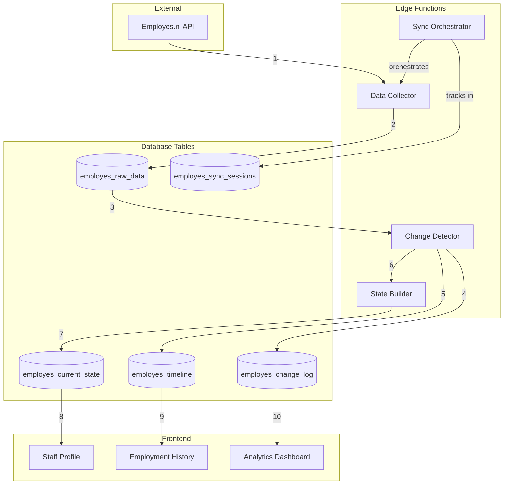
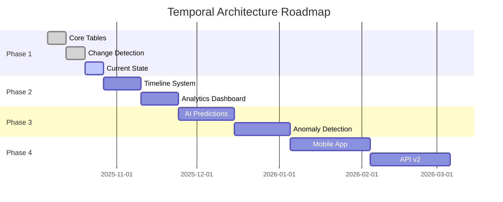

# 🏗️ TEMPORAL ARCHITECTURE - COMPLETE IMPLEMENTATION BLUEPRINT

**Date**: October 6, 2025  
**Version**: 1.0.0  
**Status**: Master Implementation Guide

---

## 📋 **TABLE OF CONTENTS**

1. [Architecture Overview](#architecture-overview)
2. [Database Schema & Relationships](#database-schema--relationships)
3. [Data Flow Processes](#data-flow-processes)
4. [Implementation Code](#implementation-code)
5. [API Endpoints](#api-endpoints)
6. [Frontend Integration](#frontend-integration)
7. [Migration Strategy](#migration-strategy)
8. [Testing & Validation](#testing--validation)
9. [Performance Optimization](#performance-optimization)
10. [Future Considerations](#future-considerations)

---

## 🏛️ **ARCHITECTURE OVERVIEW**

### **System Components**



---

## 🗄️ **DATABASE SCHEMA & RELATIONSHIPS**

### **Complete ERD (Entity Relationship Diagram)**

```sql
-- =====================================================
-- CORE TABLES
-- =====================================================

-- 1. SOURCE OF TRUTH (Existing, unchanged)
CREATE TABLE employes_raw_data (
  id UUID PRIMARY KEY DEFAULT gen_random_uuid(),
  employee_id UUID NOT NULL,
  endpoint TEXT NOT NULL,
  api_response JSONB NOT NULL,
  collected_at TIMESTAMPTZ DEFAULT NOW(),
  sync_session_id UUID REFERENCES employes_sync_sessions(id),
  is_latest BOOLEAN DEFAULT false,
  payload_hash TEXT GENERATED ALWAYS AS (md5(api_response::text)) STORED,
  
  -- Constraints
  CONSTRAINT unique_latest_per_endpoint 
    UNIQUE (employee_id, endpoint) WHERE is_latest = true,
  
  -- Indexes
  INDEX idx_raw_employee (employee_id),
  INDEX idx_raw_endpoint (endpoint),
  INDEX idx_raw_latest (is_latest) WHERE is_latest = true,
  INDEX idx_raw_session (sync_session_id),
  INDEX idx_raw_collected (collected_at DESC)
);

-- 2. FAST UI TABLE (New)
CREATE TABLE employes_current_state (
  -- Primary
  employee_id UUID PRIMARY KEY,
  
  -- Personal Info
  full_name TEXT NOT NULL,
  first_name TEXT,
  last_name TEXT,
  email TEXT,
  phone TEXT,
  birth_date DATE,
  nationality TEXT,
  gender TEXT,
  
  -- Employment Core
  employment_status TEXT DEFAULT 'active',
  start_date DATE NOT NULL,
  end_date DATE,
  termination_reason TEXT,
  
  -- Position
  department TEXT,
  department_id UUID,
  location TEXT,
  location_id UUID,
  manager_id UUID,
  manager_name TEXT,
  role TEXT,
  job_title TEXT,
  
  -- Contract
  contract_type TEXT,
  contract_end_date DATE,
  probation_end_date DATE,
  
  -- Compensation
  current_salary DECIMAL(10,2),
  current_hourly_rate DECIMAL(10,2),
  current_hours_per_week DECIMAL(5,2),
  salary_effective_date DATE,
  next_review_date DATE,
  
  -- Benefits
  vacation_days DECIMAL(5,2),
  vacation_days_used DECIMAL(5,2),
  sick_days_used INTEGER DEFAULT 0,
  
  -- Address
  street_address TEXT,
  house_number TEXT,
  city TEXT,
  postal_code TEXT,
  country TEXT DEFAULT 'NL',
  
  -- Banking
  iban TEXT,
  bank_name TEXT,
  
  -- Metadata
  last_sync_at TIMESTAMPTZ DEFAULT NOW(),
  last_sync_session_id UUID REFERENCES employes_sync_sessions(id),
  data_completeness_score DECIMAL(3,2),
  
  -- Computed fields
  months_employed INTEGER GENERATED ALWAYS AS (
    EXTRACT(YEAR FROM AGE(COALESCE(end_date, CURRENT_DATE), start_date)) * 12 +
    EXTRACT(MONTH FROM AGE(COALESCE(end_date, CURRENT_DATE), start_date))
  ) STORED,
  
  is_active BOOLEAN GENERATED ALWAYS AS (
    employment_status = 'active' AND (end_date IS NULL OR end_date > CURRENT_DATE)
  ) STORED,
  
  -- Foreign Keys
  CONSTRAINT fk_current_raw_data 
    FOREIGN KEY (employee_id) 
    REFERENCES employes_raw_data(employee_id) 
    ON DELETE CASCADE,
  
  -- Indexes
  INDEX idx_current_department (department),
  INDEX idx_current_location (location),
  INDEX idx_current_manager (manager_id),
  INDEX idx_current_status (employment_status),
  INDEX idx_current_active (is_active),
  INDEX idx_current_name (full_name)
);

-- 3. EMPLOYMENT TIMELINE (New)
CREATE TABLE employes_timeline (
  id UUID PRIMARY KEY DEFAULT gen_random_uuid(),
  employee_id UUID NOT NULL,
  
  -- Event Information
  event_type TEXT NOT NULL,
  event_date DATE NOT NULL,
  event_description TEXT,
  
  -- State snapshot at event
  salary_at_event DECIMAL(10,2),
  hourly_rate_at_event DECIMAL(10,2),
  hours_per_week_at_event DECIMAL(5,2),
  role_at_event TEXT,
  department_at_event TEXT,
  location_at_event TEXT,
  manager_at_event TEXT,
  contract_type_at_event TEXT,
  
  -- Change details
  previous_value JSONB,
  new_value JSONB,
  change_amount DECIMAL(10,2),
  change_percentage DECIMAL(5,2),
  
  -- Metadata
  source_sync_session_id UUID REFERENCES employes_sync_sessions(id),
  detected_at TIMESTAMPTZ DEFAULT NOW(),
  confidence_score DECIMAL(3,2) DEFAULT 1.0,
  is_verified BOOLEAN DEFAULT false,
  verified_by UUID,
  verified_at TIMESTAMPTZ,
  
  -- Foreign Keys
  CONSTRAINT fk_timeline_employee 
    FOREIGN KEY (employee_id) 
    REFERENCES employes_current_state(employee_id) 
    ON DELETE CASCADE,
  
  -- Constraints
  CONSTRAINT unique_timeline_event 
    UNIQUE (employee_id, event_type, event_date, COALESCE(new_value::text, '')),
  
  -- Indexes
  INDEX idx_timeline_employee (employee_id, event_date DESC),
  INDEX idx_timeline_type (event_type, event_date DESC),
  INDEX idx_timeline_salary (employee_id, event_date DESC) 
    WHERE event_type LIKE 'salary%',
  INDEX idx_timeline_recent (event_date DESC)
);

-- 4. COMPLETE CHANGE LOG (New)
CREATE TABLE employes_change_log (
  id UUID PRIMARY KEY DEFAULT gen_random_uuid(),
  
  -- Change identification
  employee_id UUID NOT NULL,
  field_path TEXT NOT NULL,
  field_category TEXT,
  
  -- Timing
  detected_at TIMESTAMPTZ DEFAULT NOW(),
  effective_date DATE,
  sync_session_id UUID NOT NULL REFERENCES employes_sync_sessions(id),
  sync_source TEXT,
  
  -- Change data
  old_value JSONB,
  new_value JSONB,
  value_type TEXT,
  
  -- Metadata
  is_correction BOOLEAN DEFAULT false,
  is_significant BOOLEAN DEFAULT true,
  requires_action BOOLEAN DEFAULT false,
  action_taken TEXT,
  action_taken_by UUID,
  action_taken_at TIMESTAMPTZ,
  
  -- Deduplication
  is_duplicate BOOLEAN DEFAULT false,
  duplicate_of UUID REFERENCES employes_change_log(id),
  
  -- Foreign Keys
  CONSTRAINT fk_change_employee 
    FOREIGN KEY (employee_id) 
    REFERENCES employes_current_state(employee_id) 
    ON DELETE CASCADE,
  
  -- Indexes
  INDEX idx_changes_employee (employee_id, detected_at DESC),
  INDEX idx_changes_session (sync_session_id),
  INDEX idx_changes_field (field_path, detected_at DESC),
  INDEX idx_changes_category (field_category, detected_at DESC),
  INDEX idx_changes_significant (employee_id, detected_at DESC) 
    WHERE is_significant = true AND is_duplicate = false,
  INDEX idx_changes_action_required (requires_action) 
    WHERE requires_action = true
);

-- 5. SYNC SESSIONS (Existing, enhanced)
CREATE TABLE employes_sync_sessions (
  id UUID PRIMARY KEY DEFAULT gen_random_uuid(),
  
  -- Session info
  session_type TEXT NOT NULL, -- 'full_sync', 'employee_sync', 'department_sync'
  status TEXT NOT NULL DEFAULT 'running', -- 'running', 'completed', 'failed'
  
  -- Timing
  started_at TIMESTAMPTZ DEFAULT NOW(),
  completed_at TIMESTAMPTZ,
  duration_ms INTEGER GENERATED ALWAYS AS (
    EXTRACT(EPOCH FROM (completed_at - started_at)) * 1000
  ) STORED,
  
  -- Scope
  employee_ids UUID[],
  department_filter TEXT,
  
  -- Results
  total_employees INTEGER DEFAULT 0,
  employees_processed INTEGER DEFAULT 0,
  changes_detected INTEGER DEFAULT 0,
  errors_count INTEGER DEFAULT 0,
  
  -- Details
  sync_details JSONB,
  error_details JSONB,
  
  -- Tracking
  source TEXT, -- 'manual', 'scheduled', 'api'
  triggered_by UUID,
  source_function TEXT,
  
  -- Indexes
  INDEX idx_session_status (status),
  INDEX idx_session_started (started_at DESC),
  INDEX idx_session_type (session_type)
);

-- =====================================================
-- RELATIONSHIPS & CONSTRAINTS
-- =====================================================

-- Ensure employee exists before adding timeline/changes
ALTER TABLE employes_timeline
  ADD CONSTRAINT fk_timeline_raw_exists
  FOREIGN KEY (employee_id) 
  REFERENCES employes_raw_data(employee_id)
  DEFERRABLE INITIALLY DEFERRED;

ALTER TABLE employes_change_log
  ADD CONSTRAINT fk_change_raw_exists
  FOREIGN KEY (employee_id) 
  REFERENCES employes_raw_data(employee_id)
  DEFERRABLE INITIALLY DEFERRED;

-- =====================================================
-- VIEWS FOR COMMON QUERIES
-- =====================================================

-- Latest changes per employee
CREATE VIEW v_employee_latest_changes AS
SELECT 
  cs.employee_id,
  cs.full_name,
  cs.department,
  cl.field_path,
  cl.old_value,
  cl.new_value,
  cl.detected_at
FROM employes_current_state cs
LEFT JOIN LATERAL (
  SELECT * FROM employes_change_log
  WHERE employee_id = cs.employee_id
    AND is_duplicate = false
    AND is_significant = true
  ORDER BY detected_at DESC
  LIMIT 10
) cl ON true;

-- Employee timeline summary
CREATE VIEW v_employee_timeline_summary AS
SELECT 
  employee_id,
  COUNT(*) FILTER (WHERE event_type = 'salary_increase') as total_raises,
  COUNT(*) FILTER (WHERE event_type = 'promotion') as total_promotions,
  COUNT(*) FILTER (WHERE event_type = 'contract_renewal') as total_renewals,
  MIN(event_date) FILTER (WHERE event_type = 'hired') as hire_date,
  MAX(event_date) FILTER (WHERE event_type LIKE 'salary%') as last_salary_change,
  MAX(salary_at_event) as highest_salary,
  AVG(change_percentage) FILTER (WHERE event_type = 'salary_increase') as avg_raise_percentage
FROM employes_timeline
GROUP BY employee_id;

-- Sync health metrics
CREATE VIEW v_sync_health AS
SELECT 
  DATE(started_at) as sync_date,
  COUNT(*) as sync_count,
  AVG(duration_ms) as avg_duration_ms,
  SUM(employees_processed) as total_employees,
  SUM(changes_detected) as total_changes,
  SUM(errors_count) as total_errors,
  ROUND(100.0 * SUM(employees_processed - errors_count) / NULLIF(SUM(employees_processed), 0), 2) as success_rate
FROM employes_sync_sessions
WHERE status = 'completed'
GROUP BY DATE(started_at)
ORDER BY sync_date DESC;
```

---

## 🔄 **DATA FLOW PROCESSES**

### **1. SYNC ORCHESTRATION PROCESS**

```typescript
// supabase/functions/employes-sync-orchestrator/index.ts

interface SyncConfig {
  mode: 'full' | 'incremental' | 'employee';
  employeeIds?: string[];
  forceRefresh?: boolean;
}

export async function orchestrateSync(config: SyncConfig) {
  // 1. Create sync session
  const session = await createSyncSession(config);
  
  try {
    // 2. Determine scope
    const employees = await determineScope(config);
    
    // 3. Process each employee
    for (const employeeId of employees) {
      await processEmployee(employeeId, session.id);
    }
    
    // 4. Finalize session
    await finalizeSyncSession(session.id, 'completed');
    
  } catch (error) {
    await finalizeSyncSession(session.id, 'failed', error);
    throw error;
  }
}

async function processEmployee(employeeId: string, sessionId: string) {
  // Phase 1: Collect raw data
  const rawData = await collectRawData(employeeId, sessionId);
  
  // Phase 2: Detect changes
  const changes = await detectChanges(employeeId, rawData, sessionId);
  
  // Phase 3: Update timeline
  await updateTimeline(employeeId, changes, sessionId);
  
  // Phase 4: Rebuild current state
  await rebuildCurrentState(employeeId, sessionId);
  
  // Phase 5: Log all changes
  await logChanges(employeeId, changes, sessionId);
}
```

### **2. RAW DATA COLLECTION**

```typescript
// supabase/functions/employes-data-collector/index.ts

async function collectRawData(
  employeeId: string, 
  sessionId: string
): Promise<RawEmployeeData> {
  
  // 1. Fetch from API
  const apiResponse = await fetch(
    `${EMPLOYES_API_BASE}/employees/${employeeId}`,
    {
      headers: {
        'Authorization': `Bearer ${EMPLOYES_API_KEY}`,
        'Accept': 'application/json'
      }
    }
  );
  
  if (!apiResponse.ok) {
    throw new Error(`API error: ${apiResponse.status}`);
  }
  
  const data = await apiResponse.json();
  
  // 2. Store raw data with versioning
  const { data: existingRaw } = await supabase
    .from('employes_raw_data')
    .select('id, payload_hash')
    .eq('employee_id', employeeId)
    .eq('endpoint', '/employees')
    .eq('is_latest', true)
    .single();
  
  const newHash = md5(JSON.stringify(data));
  
  // Only store if changed
  if (!existingRaw || existingRaw.payload_hash !== newHash) {
    // Mark old as not latest
    if (existingRaw) {
      await supabase
        .from('employes_raw_data')
        .update({ is_latest: false })
        .eq('id', existingRaw.id);
    }
    
    // Insert new
    await supabase
      .from('employes_raw_data')
      .insert({
        employee_id: employeeId,
        endpoint: '/employees',
        api_response: data,
        sync_session_id: sessionId,
        is_latest: true
      });
  }
  
  // 3. Fetch employment history
  const historyResponse = await fetch(
    `${EMPLOYES_API_BASE}/employees/${employeeId}/employments`,
    {
      headers: {
        'Authorization': `Bearer ${EMPLOYES_API_KEY}`,
        'Accept': 'application/json'
      }
    }
  );
  
  if (historyResponse.ok) {
    const historyData = await historyResponse.json();
    
    // Store employment history
    await supabase
      .from('employes_raw_data')
      .upsert({
        employee_id: employeeId,
        endpoint: '/employments',
        api_response: historyData,
        sync_session_id: sessionId,
        is_latest: true
      });
  }
  
  return data;
}
```

### **3. CHANGE DETECTION ENGINE**

```typescript
// supabase/functions/employes-change-detector/index.ts

interface ChangeDetectionResult {
  changes: Change[];
  significantChanges: Change[];
  timelineEvents: TimelineEvent[];
}

async function detectChanges(
  employeeId: string,
  newData: any,
  sessionId: string
): Promise<ChangeDetectionResult> {
  
  // 1. Get previous state
  const { data: previousRaw } = await supabase
    .from('employes_raw_data')
    .select('api_response')
    .eq('employee_id', employeeId)
    .eq('endpoint', '/employees')
    .eq('is_latest', false)
    .order('collected_at', { ascending: false })
    .limit(1)
    .single();
  
  const oldData = previousRaw?.api_response || {};
  
  // 2. Deep diff all fields
  const changes = deepDiff(oldData, newData, '');
  
  // 3. Categorize changes
  const categorizedChanges = changes.map(change => ({
    ...change,
    category: categorizeField(change.path),
    isSignificant: isSignificantChange(change),
    requiresAction: requiresHRAction(change)
  }));
  
  // 4. Generate timeline events
  const timelineEvents = generateTimelineEvents(categorizedChanges);
  
  return {
    changes: categorizedChanges,
    significantChanges: categorizedChanges.filter(c => c.isSignificant),
    timelineEvents
  };
}

function deepDiff(
  oldObj: any, 
  newObj: any, 
  path: string
): Change[] {
  const changes: Change[] = [];
  
  // Get all keys from both objects
  const allKeys = new Set([
    ...Object.keys(oldObj || {}),
    ...Object.keys(newObj || {})
  ]);
  
  for (const key of allKeys) {
    const fieldPath = path ? `${path}.${key}` : key;
    const oldValue = oldObj?.[key];
    const newValue = newObj?.[key];
    
    if (typeof oldValue === 'object' && typeof newValue === 'object') {
      // Recursive diff for nested objects
      changes.push(...deepDiff(oldValue, newValue, fieldPath));
    } else if (oldValue !== newValue) {
      // Value changed
      changes.push({
        field_path: fieldPath,
        old_value: oldValue,
        new_value: newValue,
        value_type: typeof newValue
      });
    }
  }
  
  return changes;
}

function categorizeField(fieldPath: string): string {
  if (fieldPath.startsWith('personal.') || 
      fieldPath.includes('birth') || 
      fieldPath.includes('name')) {
    return 'personal';
  }
  if (fieldPath.includes('salary') || 
      fieldPath.includes('wage') || 
      fieldPath.includes('compensation')) {
    return 'compensation';
  }
  if (fieldPath.includes('department') || 
      fieldPath.includes('manager') || 
      fieldPath.includes('role')) {
    return 'organizational';
  }
  if (fieldPath.includes('address') || 
      fieldPath.includes('phone') || 
      fieldPath.includes('email')) {
    return 'contact';
  }
  if (fieldPath.includes('contract') || 
      fieldPath.includes('employment')) {
    return 'employment';
  }
  return 'other';
}

function isSignificantChange(change: Change): boolean {
  // Salary changes are always significant
  if (change.field_path.includes('salary') || 
      change.field_path.includes('wage')) {
    return true;
  }
  
  // Role/department changes
  if (change.field_path.includes('role') || 
      change.field_path.includes('department') ||
      change.field_path.includes('manager')) {
    return true;
  }
  
  // Employment status changes
  if (change.field_path.includes('status') || 
      change.field_path.includes('contract')) {
    return true;
  }
  
  // Skip minor changes
  if (change.field_path.includes('last_modified') || 
      change.field_path.includes('updated_at')) {
    return false;
  }
  
  return false;
}

function generateTimelineEvents(changes: Change[]): TimelineEvent[] {
  const events: TimelineEvent[] = [];
  
  for (const change of changes.filter(c => c.isSignificant)) {
    const event = mapChangeToEvent(change);
    if (event) {
      events.push(event);
    }
  }
  
  return events;
}

function mapChangeToEvent(change: Change): TimelineEvent | null {
  // Salary increase
  if (change.field_path.includes('salary') && 
      change.new_value > change.old_value) {
    return {
      event_type: 'salary_increase',
      event_date: new Date(),
      event_description: `Salary increased from €${change.old_value} to €${change.new_value}`,
      previous_value: { amount: change.old_value },
      new_value: { amount: change.new_value },
      change_amount: change.new_value - change.old_value,
      change_percentage: ((change.new_value - change.old_value) / change.old_value) * 100
    };
  }
  
  // Department change
  if (change.field_path === 'department') {
    return {
      event_type: 'department_change',
      event_date: new Date(),
      event_description: `Moved from ${change.old_value} to ${change.new_value}`,
      previous_value: { department: change.old_value },
      new_value: { department: change.new_value }
    };
  }
  
  // Add more event mappings...
  
  return null;
}
```

### **4. CURRENT STATE BUILDER**

```typescript
// supabase/functions/employes-state-builder/index.ts

async function rebuildCurrentState(
  employeeId: string,
  sessionId: string
): Promise<void> {
  
  // 1. Get latest raw data
  const { data: rawEmployee } = await supabase
    .from('employes_raw_data')
    .select('api_response')
    .eq('employee_id', employeeId)
    .eq('endpoint', '/employees')
    .eq('is_latest', true)
    .single();
  
  const { data: rawEmployments } = await supabase
    .from('employes_raw_data')
    .select('api_response')
    .eq('employee_id', employeeId)
    .eq('endpoint', '/employments')
    .eq('is_latest', true)
    .single();
  
  if (!rawEmployee) {
    throw new Error(`No raw data found for employee ${employeeId}`);
  }
  
  // 2. Transform to current state
  const currentState = transformToCurrentState(
    rawEmployee.api_response,
    rawEmployments?.api_response
  );
  
  // 3. Calculate completeness score
  const completenessScore = calculateCompleteness(currentState);
  
  // 4. Upsert current state
  await supabase
    .from('employes_current_state')
    .upsert({
      ...currentState,
      employee_id: employeeId,
      last_sync_at: new Date(),
      last_sync_session_id: sessionId,
      data_completeness_score: completenessScore
    });
}

function transformToCurrentState(
  employee: any,
  employments: any
): CurrentState {
  
  // Extract current employment
  const currentEmployment = employments?.salary?.find(
    (s: any) => !s.end_date || new Date(s.end_date) > new Date()
  );
  
  const currentHours = employments?.hours?.find(
    (h: any) => !h.end_date || new Date(h.end_date) > new Date()
  );
  
  const currentContract = employments?.contracts?.find(
    (c: any) => !c.end_date || new Date(c.end_date) > new Date()
  );
  
  return {
    // Personal
    full_name: `${employee.first_name} ${employee.last_name}`.trim(),
    first_name: employee.first_name,
    last_name: employee.last_name,
    email: employee.email,
    phone: employee.phone || employee.mobile,
    birth_date: employee.date_of_birth,
    nationality: employee.nationality_id,
    gender: employee.gender,
    
    // Employment
    employment_status: employee.status || 'active',
    start_date: employee.start_date,
    end_date: employee.end_date,
    termination_reason: employee.termination_reason,
    
    // Position
    department: employee.department,
    department_id: employee.department_id,
    location: employee.location,
    location_id: employee.location_id,
    manager_id: employee.manager_id,
    manager_name: employee.manager_name,
    role: employee.role || employee.position,
    job_title: employee.job_title,
    
    // Contract
    contract_type: currentContract?.contract_duration,
    contract_end_date: currentContract?.end_date,
    probation_end_date: currentContract?.probation_end_date,
    
    // Compensation
    current_salary: currentEmployment?.month_wage,
    current_hourly_rate: currentEmployment?.hour_wage,
    current_hours_per_week: currentHours?.hours_per_week,
    salary_effective_date: currentEmployment?.start_date,
    next_review_date: calculateNextReviewDate(currentEmployment?.start_date),
    
    // Benefits
    vacation_days: employee.vacation_days,
    vacation_days_used: employee.vacation_days_used,
    sick_days_used: employee.sick_days_used,
    
    // Address
    street_address: employee.street,
    house_number: employee.housenumber,
    city: employee.city,
    postal_code: employee.zipcode,
    country: employee.country_code || 'NL',
    
    // Banking
    iban: employee.iban,
    bank_name: employee.bank_name
  };
}

function calculateCompleteness(state: CurrentState): number {
  const requiredFields = [
    'full_name', 'email', 'department', 'start_date',
    'employment_status', 'current_salary'
  ];
  
  const optionalFields = [
    'phone', 'birth_date', 'nationality', 'street_address',
    'city', 'postal_code', 'iban', 'manager_name'
  ];
  
  let score = 0;
  let maxScore = 0;
  
  // Required fields worth 2 points each
  for (const field of requiredFields) {
    maxScore += 2;
    if (state[field]) score += 2;
  }
  
  // Optional fields worth 1 point each
  for (const field of optionalFields) {
    maxScore += 1;
    if (state[field]) score += 1;
  }
  
  return score / maxScore;
}
```

### **5. TIMELINE UPDATER**

```typescript
// supabase/functions/employes-timeline-updater/index.ts

async function updateTimeline(
  employeeId: string,
  changes: Change[],
  sessionId: string
): Promise<void> {
  
  const timelineEvents = [];
  
  // Process significant changes
  for (const change of changes.filter(c => c.isSignificant)) {
    const event = createTimelineEvent(change, employeeId);
    if (event) {
      timelineEvents.push(event);
    }
  }
  
  // Get current state for context
  const { data: currentState } = await supabase
    .from('employes_current_state')
    .select('*')
    .eq('employee_id', employeeId)
    .single();
  
  // Insert timeline events (with deduplication)
  for (const event of timelineEvents) {
    await supabase
      .from('employes_timeline')
      .upsert({
        ...event,
        employee_id: employeeId,
        source_sync_session_id: sessionId,
        
        // Add state context
        salary_at_event: currentState?.current_salary,
        hours_per_week_at_event: currentState?.current_hours_per_week,
        role_at_event: currentState?.role,
        department_at_event: currentState?.department,
        location_at_event: currentState?.location,
        manager_at_event: currentState?.manager_name,
        contract_type_at_event: currentState?.contract_type
      }, {
        onConflict: 'employee_id,event_type,event_date,new_value',
        ignoreDuplicates: false
      });
  }
}
```

---

## 🔌 **API ENDPOINTS**

### **REST API Structure**

```typescript
// API Routes Configuration

const routes = {
  // Sync operations
  'POST /sync/full': orchestrateFullSync,
  'POST /sync/employee/:id': syncSingleEmployee,
  'POST /sync/department/:dept': syncDepartment,
  
  // Current state queries
  'GET /employees/current': getCurrentEmployees,
  'GET /employees/:id/current': getCurrentEmployee,
  
  // Timeline queries
  'GET /employees/:id/timeline': getEmployeeTimeline,
  'GET /timeline/events': getTimelineEvents,
  
  // Change log queries
  'GET /changes/recent': getRecentChanges,
  'GET /employees/:id/changes': getEmployeeChanges,
  
  // Analytics
  'GET /analytics/changes': getChangeAnalytics,
  'GET /analytics/trends': getTrendAnalytics
};
```

### **GraphQL Schema**

```graphql
type Employee {
  id: ID!
  currentState: CurrentState!
  timeline: [TimelineEvent!]!
  recentChanges: [Change!]!
  rawData: JSON
}

type CurrentState {
  employeeId: ID!
  fullName: String!
  email: String
  department: String
  currentSalary: Float
  employmentStatus: String!
  lastSyncAt: DateTime!
}

type TimelineEvent {
  id: ID!
  eventType: String!
  eventDate: Date!
  description: String
  previousValue: JSON
  newValue: JSON
  changeAmount: Float
  changePercentage: Float
}

type Change {
  id: ID!
  fieldPath: String!
  oldValue: JSON
  newValue: JSON
  detectedAt: DateTime!
  isSignificant: Boolean!
}

type Query {
  employee(id: ID!): Employee
  employees(filter: EmployeeFilter): [Employee!]!
  timeline(employeeId: ID!, eventTypes: [String!]): [TimelineEvent!]!
  changes(employeeId: ID!, since: DateTime): [Change!]!
}

type Mutation {
  syncEmployee(id: ID!): SyncResult!
  syncAll: SyncResult!
  verifyTimelineEvent(id: ID!): TimelineEvent!
}
```

---

## 🎨 **FRONTEND INTEGRATION**

### **React Hooks**

```typescript
// hooks/useEmployeeState.ts

export function useEmployeeCurrentState(employeeId: string) {
  return useQuery({
    queryKey: ['employee-current', employeeId],
    queryFn: async () => {
      const { data, error } = await supabase
        .from('employes_current_state')
        .select('*')
        .eq('employee_id', employeeId)
        .single();
      
      if (error) throw error;
      return data;
    },
    staleTime: 5 * 60 * 1000, // 5 minutes
  });
}

// hooks/useEmployeeTimeline.ts

export function useEmployeeTimeline(employeeId: string) {
  return useQuery({
    queryKey: ['employee-timeline', employeeId],
    queryFn: async () => {
      const { data, error } = await supabase
        .from('employes_timeline')
        .select('*')
        .eq('employee_id', employeeId)
        .order('event_date', { ascending: false });
      
      if (error) throw error;
      return data;
    },
    staleTime: 10 * 60 * 1000, // 10 minutes
  });
}

// hooks/useEmployeeChanges.ts

export function useEmployeeChanges(employeeId: string, options?: {
  onlySignificant?: boolean;
  since?: Date;
}) {
  return useQuery({
    queryKey: ['employee-changes', employeeId, options],
    queryFn: async () => {
      let query = supabase
        .from('employes_change_log')
        .select('*')
        .eq('employee_id', employeeId)
        .eq('is_duplicate', false)
        .order('detected_at', { ascending: false })
        .limit(100);
      
      if (options?.onlySignificant) {
        query = query.eq('is_significant', true);
      }
      
      if (options?.since) {
        query = query.gte('detected_at', options.since.toISOString());
      }
      
      const { data, error } = await query;
      
      if (error) throw error;
      return data;
    },
  });
}
```

### **Components**

```tsx
// components/EmployeeProfile.tsx

export function EmployeeProfile({ employeeId }: { employeeId: string }) {
  const { data: currentState, isLoading } = useEmployeeCurrentState(employeeId);
  const { data: timeline } = useEmployeeTimeline(employeeId);
  
  if (isLoading) return <Skeleton />;
  if (!currentState) return <NotFound />;
  
  return (
    <div className="space-y-6">
      {/* Current State Card */}
      <Card>
        <CardHeader>
          <CardTitle>{currentState.full_name}</CardTitle>
          <Badge>{currentState.employment_status}</Badge>
        </CardHeader>
        <CardContent>
          <dl className="grid grid-cols-2 gap-4">
            <div>
              <dt>Department</dt>
              <dd>{currentState.department}</dd>
            </div>
            <div>
              <dt>Current Salary</dt>
              <dd>€{currentState.current_salary}</dd>
            </div>
            <div>
              <dt>Start Date</dt>
              <dd>{formatDate(currentState.start_date)}</dd>
            </div>
            <div>
              <dt>Last Sync</dt>
              <dd>{formatRelative(currentState.last_sync_at)}</dd>
            </div>
          </dl>
        </CardContent>
      </Card>
      
      {/* Timeline */}
      <Card>
        <CardHeader>
          <CardTitle>Employment Timeline</CardTitle>
        </CardHeader>
        <CardContent>
          <Timeline events={timeline} />
        </CardContent>
      </Card>
    </div>
  );
}

// components/Timeline.tsx

export function Timeline({ events }: { events: TimelineEvent[] }) {
  return (
    <div className="space-y-4">
      {events.map((event) => (
        <div key={event.id} className="flex gap-4">
          <div className="flex-shrink-0">
            <TimelineIcon type={event.event_type} />
          </div>
          <div className="flex-grow">
            <div className="flex justify-between">
              <h4 className="font-medium">{event.event_description}</h4>
              <time className="text-sm text-muted-foreground">
                {formatDate(event.event_date)}
              </time>
            </div>
            {event.change_amount && (
              <div className="mt-1">
                <Badge variant="success">
                  +€{event.change_amount} ({event.change_percentage}%)
                </Badge>
              </div>
            )}
          </div>
        </div>
      ))}
    </div>
  );
}
```

---

## 📦 **MIGRATION STRATEGY**

### **Phase 1: Database Setup**

```sql
-- Migration: 001_create_temporal_tables.sql

BEGIN;

-- Create tables in dependency order
CREATE TABLE employes_current_state (...);
CREATE TABLE employes_timeline (...);
CREATE TABLE employes_change_log (...);

-- Add foreign keys
ALTER TABLE employes_timeline ADD CONSTRAINT ...;
ALTER TABLE employes_change_log ADD CONSTRAINT ...;

-- Create indexes
CREATE INDEX ...;

-- Create views
CREATE VIEW v_employee_latest_changes AS ...;
CREATE VIEW v_employee_timeline_summary AS ...;

COMMIT;
```

### **Phase 2: Data Migration**

```sql
-- Migration: 002_backfill_current_state.sql

-- Populate current state from existing raw data
INSERT INTO employes_current_state (employee_id, full_name, ...)
SELECT 
  employee_id,
  api_response->>'first_name' || ' ' || api_response->>'last_name',
  ...
FROM employes_raw_data
WHERE endpoint = '/employees' 
  AND is_latest = true;
```

### **Phase 3: Historical Data**

```sql
-- Migration: 003_backfill_timeline.sql

-- Generate timeline from employes_changes
INSERT INTO employes_timeline (employee_id, event_type, event_date, ...)
SELECT 
  employee_id,
  CASE 
    WHEN change_type = 'salary_change' AND new_value > old_value THEN 'salary_increase'
    WHEN change_type = 'salary_change' THEN 'salary_decrease'
    ELSE change_type
  END,
  effective_date,
  ...
FROM employes_changes
WHERE is_duplicate = false;
```

---

## 🧪 **TESTING & VALIDATION**

### **Test Scenarios**

```typescript
// tests/temporal-architecture.test.ts

describe('Temporal Architecture', () => {
  describe('Data Collection', () => {
    it('should store raw data with versioning', async () => {
      const result = await collectRawData('test-employee', 'test-session');
      expect(result).toBeDefined();
      
      // Verify is_latest flag
      const { data } = await supabase
        .from('employes_raw_data')
        .select('*')
        .eq('employee_id', 'test-employee')
        .eq('is_latest', true);
      
      expect(data).toHaveLength(1);
    });
  });
  
  describe('Change Detection', () => {
    it('should detect all field changes', async () => {
      const oldData = { salary: 2000, department: 'IT' };
      const newData = { salary: 2200, department: 'IT' };
      
      const changes = deepDiff(oldData, newData, '');
      
      expect(changes).toHaveLength(1);
      expect(changes[0].field_path).toBe('salary');
      expect(changes[0].old_value).toBe(2000);
      expect(changes[0].new_value).toBe(2200);
    });
    
    it('should categorize changes correctly', async () => {
      const change = { field_path: 'salary', old_value: 2000, new_value: 2200 };
      const category = categorizeField(change.field_path);
      
      expect(category).toBe('compensation');
    });
  });
  
  describe('Timeline Generation', () => {
    it('should create timeline events from changes', async () => {
      const changes = [
        { field_path: 'salary', old_value: 2000, new_value: 2200, isSignificant: true }
      ];
      
      const events = generateTimelineEvents(changes);
      
      expect(events).toHaveLength(1);
      expect(events[0].event_type).toBe('salary_increase');
      expect(events[0].change_amount).toBe(200);
      expect(events[0].change_percentage).toBe(10);
    });
  });
});
```

### **Data Integrity Checks**

```sql
-- Validation queries

-- Check for orphaned timeline events
SELECT t.* 
FROM employes_timeline t
LEFT JOIN employes_current_state cs ON t.employee_id = cs.employee_id
WHERE cs.employee_id IS NULL;

-- Check for duplicate changes
SELECT 
  employee_id, 
  field_path, 
  old_value, 
  new_value, 
  COUNT(*) 
FROM employes_change_log
WHERE is_duplicate = false
GROUP BY employee_id, field_path, old_value, new_value
HAVING COUNT(*) > 1;

-- Verify current state freshness
SELECT 
  employee_id,
  full_name,
  last_sync_at,
  EXTRACT(DAY FROM AGE(NOW(), last_sync_at)) as days_since_sync
FROM employes_current_state
WHERE last_sync_at < NOW() - INTERVAL '30 days';
```

---

## ⚡ **PERFORMANCE OPTIMIZATION**

### **Query Optimization**

```sql
-- Materialized view for dashboard
CREATE MATERIALIZED VIEW mv_employee_dashboard AS
SELECT 
  cs.*,
  tls.total_raises,
  tls.total_promotions,
  tls.last_salary_change,
  (
    SELECT COUNT(*) 
    FROM employes_change_log 
    WHERE employee_id = cs.employee_id 
      AND detected_at > NOW() - INTERVAL '7 days'
  ) as recent_changes_count
FROM employes_current_state cs
LEFT JOIN v_employee_timeline_summary tls ON cs.employee_id = tls.employee_id;

-- Refresh strategy
CREATE OR REPLACE FUNCTION refresh_dashboard_view()
RETURNS void AS $$
BEGIN
  REFRESH MATERIALIZED VIEW CONCURRENTLY mv_employee_dashboard;
END;
$$ LANGUAGE plpgsql;

-- Schedule refresh
SELECT cron.schedule('refresh-dashboard', '0 */6 * * *', 'SELECT refresh_dashboard_view()');
```

### **Partitioning Strategy**

```sql
-- Partition change_log by year
ALTER TABLE employes_change_log 
PARTITION BY RANGE (EXTRACT(YEAR FROM detected_at));

-- Create partitions
CREATE TABLE employes_change_log_2025 
PARTITION OF employes_change_log
FOR VALUES FROM (2025) TO (2026);

CREATE TABLE employes_change_log_2026 
PARTITION OF employes_change_log
FOR VALUES FROM (2026) TO (2027);
```

---

## 🔮 **FUTURE CONSIDERATIONS**

### **Scalability Path**

1. **10-100 Employees** (Current)
   - Single database
   - All tables in one schema
   - Direct queries

2. **100-1000 Employees** (Year 2)
   - Add caching layer (Redis)
   - Implement materialized views
   - Background job processing

3. **1000+ Employees** (Year 3+)
   - Separate read/write databases
   - Event streaming (Kafka)
   - Microservices architecture

### **Feature Roadmap**



### **AI Integration Points**

```typescript
// Future AI capabilities

interface AIInsights {
  // Predictive analytics
  predictNextSalaryIncrease(employeeId: string): Promise<{
    probability: number;
    estimatedDate: Date;
    estimatedAmount: number;
  }>;
  
  // Anomaly detection
  detectAnomalies(changes: Change[]): Promise<{
    anomalies: Anomaly[];
    riskScore: number;
  }>;
  
  // Pattern recognition
  findSimilarCareerPaths(employeeId: string): Promise<{
    similarEmployees: string[];
    commonPatterns: Pattern[];
  }>;
  
  // Recommendations
  suggestRetentionActions(employeeId: string): Promise<{
    riskLevel: 'low' | 'medium' | 'high';
    recommendedActions: Action[];
  }>;
}
```

---

## 📚 **APPENDIX**

### **Dependencies**

```json
{
  "dependencies": {
    "@supabase/supabase-js": "^2.39.3",
    "@tanstack/react-query": "^5.0.0",
    "date-fns": "^2.30.0",
    "zod": "^3.22.0"
  },
  "devDependencies": {
    "@types/node": "^20.0.0",
    "vitest": "^1.0.0"
  }
}
```

### **Environment Variables**

```bash
# .env.local

# Supabase
NEXT_PUBLIC_SUPABASE_URL=https://xxx.supabase.co
NEXT_PUBLIC_SUPABASE_ANON_KEY=xxx
SUPABASE_SERVICE_ROLE_KEY=xxx

# Employes.nl API
EMPLOYES_API_BASE=https://connect.employes.nl/v4
EMPLOYES_API_KEY=xxx
EMPLOYES_COMPANY_ID=xxx

# Feature Flags
ENABLE_TIMELINE=true
ENABLE_CHANGE_LOG=true
ENABLE_AI_INSIGHTS=false
```

### **Monitoring Queries**

```sql
-- Daily health check
SELECT 
  'Sync Health' as metric,
  COUNT(*) as total_syncs,
  AVG(duration_ms) as avg_duration,
  MAX(completed_at) as last_sync
FROM employes_sync_sessions
WHERE started_at > NOW() - INTERVAL '24 hours';

-- Data quality
SELECT 
  'Data Quality' as metric,
  AVG(data_completeness_score) as avg_completeness,
  COUNT(*) FILTER (WHERE data_completeness_score < 0.5) as low_quality_count
FROM employes_current_state;

-- Change velocity
SELECT 
  DATE(detected_at) as date,
  COUNT(*) as changes_detected,
  COUNT(DISTINCT employee_id) as employees_affected
FROM employes_change_log
WHERE detected_at > NOW() - INTERVAL '7 days'
GROUP BY DATE(detected_at)
ORDER BY date DESC;
```

---

## ✅ **CHECKLIST**

### **Implementation Checklist**

- [ ] Create database migrations
- [ ] Deploy Edge Functions
- [ ] Update change detector
- [ ] Build state transformer
- [ ] Create timeline generator
- [ ] Update frontend hooks
- [ ] Add monitoring
- [ ] Write tests
- [ ] Update documentation
- [ ] Train team

### **Validation Checklist**

- [ ] No duplicate changes
- [ ] Current state accurate
- [ ] Timeline events correct
- [ ] Performance < 100ms
- [ ] All indexes created
- [ ] Foreign keys valid
- [ ] Views working
- [ ] Sync completing
- [ ] UI displaying data
- [ ] Analytics accurate

---

**END OF BLUEPRINT**

This is your complete reference for the Temporal Architecture implementation. Every aspect is documented for current and future development. 🚀
