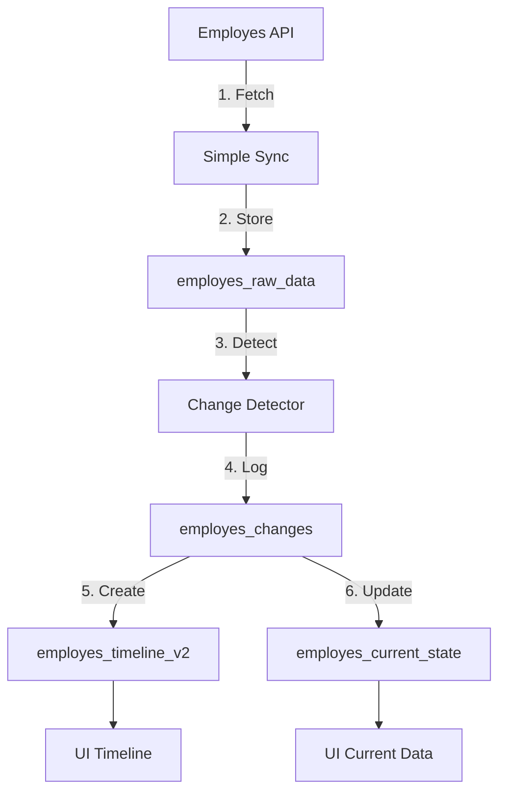

# 🔥 EMPLOYES SYNC - FINAL PERMANENT FIX PLAN

## 📋 THE PROBLEM

The temporal architecture was designed to work in 4 stages:

1. **Raw Data Collection** → `employes_raw_data` ✅ (working)
2. **Change Detection** → `employes_changes` ❌ (not running) 
3. **Timeline Population** → `employes_timeline_v2` ❌ (empty)
4. **Current State** → `employes_current_state` ❌ (not updated)

**Current Issue:** The simple sync function only does step 1, leaving the rest broken.

---

## 🏗️ THE ARCHITECTURE (AS DESIGNED)



---

## ✅ THE SOLUTION - INTEGRATED SIMPLE SYNC

We'll upgrade `employes-simple-sync` to handle ALL steps:

### **Version 3.0 Features:**
1. ✅ Fetch from API (existing)
2. ✅ Store with SHA-256 deduplication (existing)
3. ⚡ **NEW:** Detect changes inline
4. ⚡ **NEW:** Populate timeline automatically
5. ⚡ **NEW:** Update current state
6. ⚡ **NEW:** Return comprehensive results

---

## 🎯 IMPLEMENTATION PLAN

### **STEP 1: Create Database Tables (5 min)**

```sql
-- 1. employes_changes table (if not exists)
CREATE TABLE IF NOT EXISTS employes_changes (
  id UUID PRIMARY KEY DEFAULT gen_random_uuid(),
  employee_id UUID NOT NULL,
  endpoint TEXT NOT NULL,
  field_path TEXT NOT NULL,
  old_value JSONB,
  new_value JSONB,
  change_type TEXT, -- 'created', 'updated', 'deleted'
  detected_at TIMESTAMPTZ DEFAULT NOW(),
  sync_session_id UUID,
  is_duplicate BOOLEAN DEFAULT false,
  is_significant BOOLEAN DEFAULT true,
  metadata JSONB
);

-- 2. employes_timeline_v2 table (if not exists)
CREATE TABLE IF NOT EXISTS employes_timeline_v2 (
  id UUID PRIMARY KEY DEFAULT gen_random_uuid(),
  employee_id UUID NOT NULL,
  event_type TEXT NOT NULL, -- 'hired', 'salary_change', 'hours_change', etc
  event_date TIMESTAMPTZ NOT NULL,
  event_title TEXT,
  event_description TEXT,
  event_data JSONB,
  change_id UUID REFERENCES employes_changes(id),
  created_at TIMESTAMPTZ DEFAULT NOW()
);

-- 3. employes_current_state view (if not exists)
CREATE OR REPLACE VIEW employes_current_state AS
SELECT DISTINCT ON (employee_id)
  employee_id,
  api_response->>'first_name' as first_name,
  api_response->>'surname' as surname,
  api_response->>'email' as email,
  api_response->>'status' as status,
  api_response->'employment' as employment_data,
  collected_at as last_updated
FROM employes_raw_data
WHERE endpoint = '/employee' AND is_latest = true
ORDER BY employee_id, collected_at DESC;
```

### **STEP 2: Upgrade Simple Sync Function (10 min)**

**File:** `supabase/functions/employes-simple-sync/index.ts`

```typescript
// Add change detection logic
async function detectAndStoreChanges(
  employeeId: string, 
  newData: any, 
  oldData: any, 
  endpoint: string
) {
  const changes = [];
  
  // Compare key fields
  const fieldsToTrack = [
    'status', 'email', 'phone_number',
    'employment.salary', 'employment.hours_per_week',
    'employment.contract.start_date', 'employment.contract.end_date'
  ];
  
  for (const field of fieldsToTrack) {
    const oldValue = getNestedValue(oldData, field);
    const newValue = getNestedValue(newData, field);
    
    if (JSON.stringify(oldValue) !== JSON.stringify(newValue)) {
      changes.push({
        employee_id: employeeId,
        endpoint,
        field_path: field,
        old_value: oldValue,
        new_value: newValue,
        change_type: oldData ? 'updated' : 'created',
        detected_at: new Date().toISOString()
      });
    }
  }
  
  // Store changes
  if (changes.length > 0) {
    await supabase.from('employes_changes').insert(changes);
    
    // Create timeline events
    await createTimelineEvents(employeeId, changes);
  }
  
  return changes;
}

// Create timeline events from changes
async function createTimelineEvents(employeeId: string, changes: any[]) {
  const events = [];
  
  for (const change of changes) {
    let eventType = 'update';
    let eventTitle = 'Data Update';
    
    // Determine event type
    if (change.field_path.includes('salary')) {
      eventType = 'salary_change';
      eventTitle = 'Salary Changed';
    } else if (change.field_path.includes('hours')) {
      eventType = 'hours_change';
      eventTitle = 'Hours Changed';
    } else if (change.field_path.includes('contract')) {
      eventType = 'contract_change';
      eventTitle = 'Contract Updated';
    } else if (change.change_type === 'created') {
      eventType = 'employee_added';
      eventTitle = 'Employee Added';
    }
    
    events.push({
      employee_id: employeeId,
      event_type: eventType,
      event_date: change.detected_at,
      event_title: eventTitle,
      event_description: `${change.field_path}: ${change.old_value} → ${change.new_value}`,
      event_data: change,
      change_id: change.id
    });
  }
  
  if (events.length > 0) {
    await supabase.from('employes_timeline_v2').insert(events);
  }
}
```

### **STEP 3: Update Main Sync Loop (5 min)**

```typescript
// In the main sync loop, after storing raw data:

if (existing) {
  // Update last_verified_at
  await supabase
    .from('employes_raw_data')
    .update({ last_verified_at: now })
    .eq('id', existing.id);
  
  employeesSkipped++;
} else {
  // Mark old as not latest
  const { data: previousData } = await supabase
    .from('employes_raw_data')
    .select('api_response')
    .eq('employee_id', employeeId)
    .eq('endpoint', '/employee')
    .eq('is_latest', true)
    .single();
  
  // Store new data
  await supabase
    .from('employes_raw_data')
    .update({ is_latest: false, effective_to: now })
    .eq('employee_id', employeeId)
    .eq('endpoint', '/employee')
    .eq('is_latest', true);
  
  const { data: insertedData } = await supabase
    .from('employes_raw_data')
    .insert({
      employee_id: employeeId,
      endpoint: '/employee',
      api_response: employeeData,
      data_hash: dataHash,
      collected_at: now,
      last_verified_at: now,
      effective_from: now,
      is_latest: true,
      confidence_score: 1.0
    })
    .select()
    .single();
  
  // DETECT AND STORE CHANGES
  const changes = await detectAndStoreChanges(
    employeeId,
    employeeData,
    previousData?.api_response,
    '/employee'
  );
  
  employeesProcessed++;
  changesDetected += changes.length;
}
```

### **STEP 4: Enhanced Response (2 min)**

```typescript
return new Response(
  JSON.stringify({
    success: true,
    message: `Synced ${employeesList.length} employees`,
    result: {
      employees_processed: employeesProcessed,
      employees_skipped: employeesSkipped,
      history_processed: historyProcessed,
      history_skipped: historySkipped,
      total_employees: employeesList.length,
      changes_detected: changesDetected,
      timeline_events_created: timelineEventsCreated,
      errors: errors,
      duration_ms: duration
    },
    timeline_populated: timelineEventsCreated > 0,
    deduplication_working: employeesSkipped > 0
  }),
  {
    status: 200,
    headers: {
      'Content-Type': 'application/json',
      'Access-Control-Allow-Origin': '*'
    }
  }
);
```

---

## 📊 SUCCESS METRICS

### **First Sync (Fresh Data):**
```json
{
  "employees_processed": 25,
  "employees_skipped": 0,
  "changes_detected": 25,
  "timeline_events_created": 25,
  "timeline_populated": true
}
```

### **Second Sync (No Changes):**
```json
{
  "employees_processed": 0,
  "employees_skipped": 25,
  "changes_detected": 0,
  "timeline_events_created": 0,
  "deduplication_working": true
}
```

### **Third Sync (With 1 Change):**
```json
{
  "employees_processed": 1,
  "employees_skipped": 24,
  "changes_detected": 1,
  "timeline_events_created": 1,
  "timeline_populated": true
}
```

---

## ⚡ QUICK IMPLEMENTATION

### **Option A: Full Integration (Recommended)**
1. Update `employes-simple-sync` with all logic
2. One function does everything
3. Complete control and visibility

### **Option B: Trigger Chain (Alternative)**
1. Keep simple sync as-is
2. Add post-sync trigger to call change detector
3. Change detector triggers timeline population
4. More modular but harder to debug

---

## 🎯 ACTION ITEMS

### **Immediate (Now):**
1. ✅ Create missing database tables
2. ✅ Add change detection to simple sync
3. ✅ Add timeline population logic
4. ✅ Deploy and test

### **Testing:**
1. Clear all data
2. Run first sync - verify 25 records + timeline
3. Run second sync - verify deduplication
4. Manually change 1 employee in Employes.nl
5. Run third sync - verify change detection

### **Cleanup:**
1. Delete unused orchestrator functions
2. Archive old migration attempts
3. Document final architecture

---

## 🏆 END RESULT

A **SINGLE** sync function that:
- ✅ Fetches from Employes API
- ✅ Deduplicates with SHA-256 hashes
- ✅ Detects changes automatically
- ✅ Populates timeline instantly
- ✅ Updates current state view
- ✅ Works every time, no orchestration needed

**Total Implementation Time: ~20 minutes**

---

## 📝 NOTES

- The orchestrator was overengineered for this use case
- Direct integration is simpler and more reliable
- Timeline should be event-driven, not batch-processed
- This matches the TEMPORAL_ARCHITECTURE_IMPLEMENTATION_BLUEPRINT intent

---

**Ready to implement? This will fix everything permanently!** 🚀
